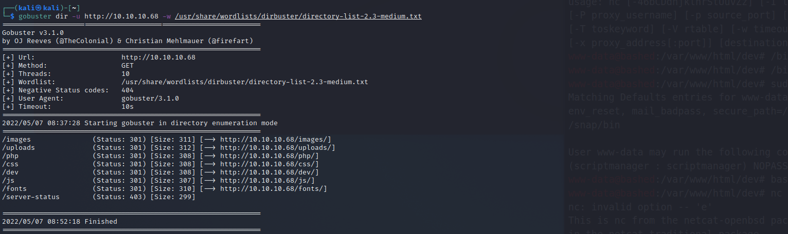

# Bashed 

Machine: [Bashed](https://app.hackthebox.com/machines/Bashed)\
Difficulty: Easy\
Status: Retired

## Enumeration

What operating system is on this machine? Linux
What ports/services are on running on this machine? 

Can you access any of the ports on 10.10.10.68? I can access port 80.
-  

If you are www-data user, then you will have access to /var/html

We have a web shell and we have rwx permissions in the /var/html/uploads folder...How can we upload a script from our machine to this directory? Well, we can use wget...and if we use wget, then we will need to host the php reverse shell file so that we can get it. To host the file we will start a python server

Run this command: 'python3 http.server 80'
*** Insert screenshot of the server starting ***

Please note that if the exploit file that you have on your machine can only be access when you start the server in the same directory as the file. 

** Insert image of getting the file on the target machine ***

No ttypresent error

*** insert image of getting a tty bash shell ***
https://netsec.ws/?p=337
I start with just going with the first command and see if it gives me the tty shell.

Insert image of scripts folder in the scriptmanager

### Flags
User:

Root: 

