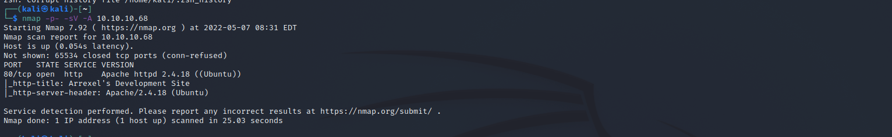
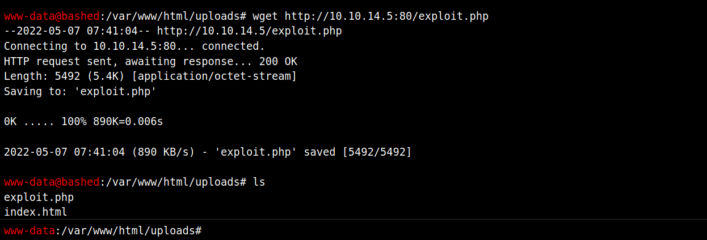

# Bashed 

Machine: [Bashed](https://app.hackthebox.com/machines/Bashed)\
Difficulty: Easy\
Status: Retired

## Enumeration

What operating system is on this machine? Linux
What ports/services are on running on this machine? 
-  

Can you access any of the ports on 10.10.10.68? I can access port 80.

After browsing around some on the webpage and using the gobuster tool, I came across a file that gave me a shell just by clicking on that file. From there I was able to navigate to the user directory and get the user flag.

-  

-  

If you are www-data user, then you will have access to /var/html

We have a web shell and we have rwx permissions in the /var/html/uploads folder...How can we upload a script from our machine to this directory? Well, we can use wget...and if we use wget, then we will need to host the php reverse shell file so that we can get it. To host the file we will start a python server

Run this command: 'python3 http.server 80'

Please note that if the exploit file that you have on your machine can only be access when you start the server in the same directory as the file. 

** Insert image of getting the file on the target machine ***

No ttypresent error

*** insert image of getting a tty bash shell ***
https://netsec.ws/?p=337
I start with just going with the first command and see if it gives me the tty shell.

https://pentestmonkey.net/cheat-sheet/shells/reverse-shell-cheat-sheet

### Flags
User: After browsing around some on the webpage and using the gobuster tool, I came across a file that gave me a shell just by clicking on that file. From there I was able to navigate to the user directory and get the user flag.

-  

After getting the user flag, I went ahead and decided to see what I can run as sudo by running the command: 
'sudo -l'. Turns out I can sudo as another user called scriptmanager. At this time I still only had the shell in the browser as www-data. If you are www-data user, then you will have access to /var/html\

We have a web shell and we have rwx permissions in the /var/html/uploads folder...How can we upload a script from our machine to this directory? Well, we can use wget...and if we use wget, then we will need to host the php reverse shell file so that we can get it. To host the file we will start a python server

Run this command: 'python3 http.server 80'

-  

Looking at the uploads directory, we have write access. Let's upload a php file that we help give us a reverse shell so we don't have to use the one in the browser. Please note that at this point we have our python server running and we can just use wget to get the file onto the target machine.

-  

Now with the file uploaded, lets start a netcat listner on a port. THe php script is going to point to my machine and the specified port so we need to use the same port for the netcat listener.

-  

We have a reverse shell!
-  

Next I escelated to the scriptmanager user by doing this: 'sudo su scriptmanager /bin/bash'.  Once I was the scriptmanager user, I went up to the root directory to look at all of the system directorys etc. All of the directories that were shown were owned by root, but there was one directory 'scripts' that was owned by the user scriptmanager. Navigating to the '/scripts' directory and view the files, there is a python file and a txt. \
The python script has rwx privileges for the scriptmanager user but the txt file and only be rwx by root. I had to look this up online, but if you type the command to view the files, permissions, groups and time of the files, you can see that the .txt file time keeps getting updated every minute or so....since this is happening periodically there is more than likely a cron job running the python script which puts it's output in the .txt file when the cron job is run. \

Based on this, we can probably just upload a python reverse shell, start a netcat listener, and then we should have a root shell. I used a python reverse shell, started a python server and pulled in the file on the target machine. Rename the exploit.py script with the same name of the python script that is getting executing by a cron job. After waiting for the cron job to execute the script, we have now created a reverse shell with root privileges. 

Root: 
-  

-  
