# Beep

Machine: [Blue](https://app.hackthebox.com/machines/Beep)\
Difficulty: Easy\
Status: Retired

## Enumeration

What operating system is on this machine? Linux
What ports/services are on running on this machine? In the screenshot below, I just showed the open ports because there was a lot of information in the nmap output when I was checking for version etc.
- 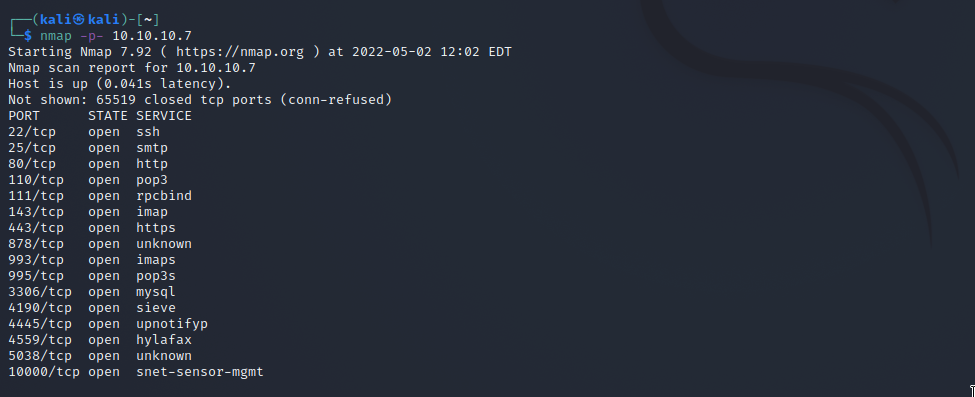 

Can you access any of the ports on 10.10.10.7? I can access port 80 and port 10000.
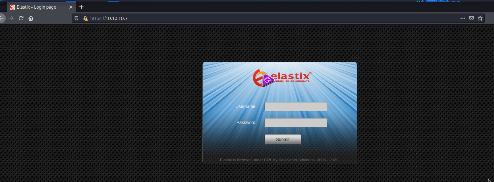 

Since smtp is running on this machine, I went ahead and run some nmap scripts to see what vulnerabilities may exist.

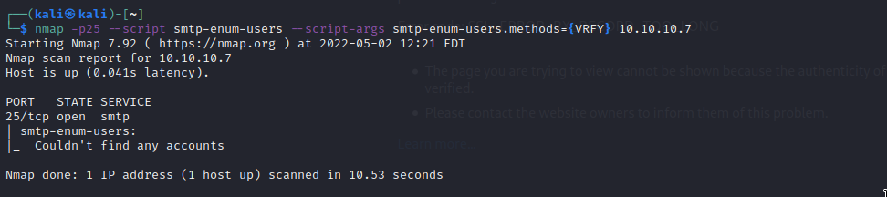 

I went ahead and ran all of the smtp scripts that were available to me with nmap, but I did not have any success getting any information in terms of users etc. 

I decided to perform enumeration on port 80. the first thing I did was to use gobuster to see what directories are available and I also examined the source code for the webpage to see if there is any useful information.

For whatever reason, gobuster was not working for me and it was giving me this error: 
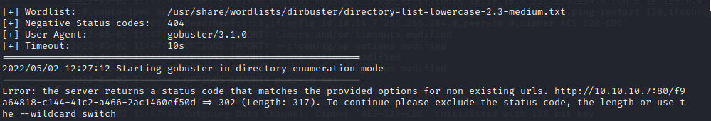 

On the webpage on port 80, it looks to just be a login page that uses Elastix. I am not sure what Elastix is so I did little research to find out that it is a web interface that provides email, IM, fax, and several other software options. I tried to login using credentials that I found online, admin/admin, but I was not able to login. 

## Exploitation
Next, I used the searchsploit tool to lookup 'Elastix'. 
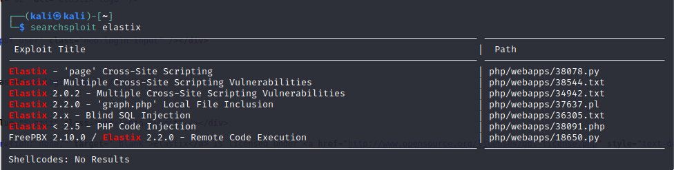 

The remote code execution seemed like the most valuable thing for me, so I went on exploit db and found the exploit script, and examined it. https://www.exploit-db.com/exploits/18650

I ran the script but I did not have any success, so I tried the local file exclusion exploit. With the LFI exploit, the script on exploit db had a direct path to do the exploit, I just had to point to it in my directory. Once I updated the path in the browser, it took me to a page that had a bunch of configuration information...there were also some passwords in this file.
passw0rd 
jEhdIekWmdjE

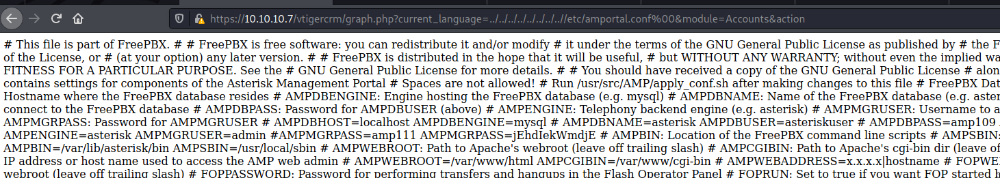 

I tried to use the passwords above on the elastix login page but that didn't work. Finally, trying the credentials on the web service running on port 10000, I was able to login with root/jEhdIekWmdjE. (I was stuck at this point and had to look at a walkthrough....originally I was just using admin as the username when trying to login).

Logged in to port 10000 with the same password as before.
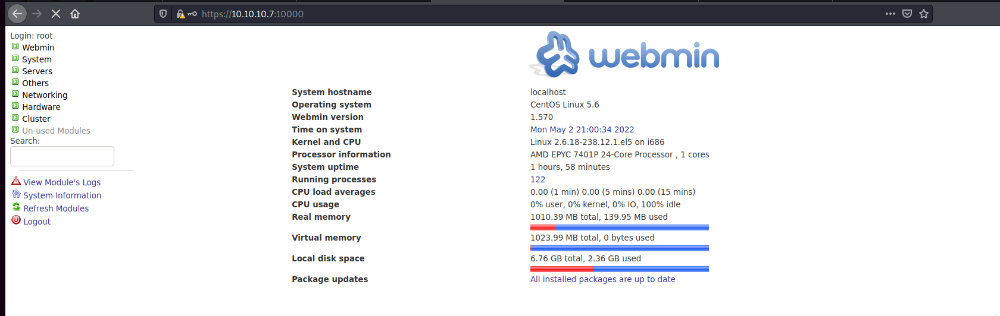 

I did not know this before, but webmin will allow you to run scheduled commands and scheduled cron jobs. This is important because since we are logged in as root, we can probably update/add a command or cron job to create a reverse shell for us. To run a command or cron job, it is located under the systems tab.

In the walkthrough that I followed after I was stuck, I decided to use the same bash command that will spawn a reverse shell for me.
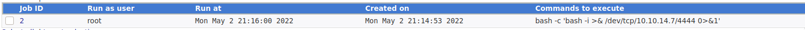 

Now I have a reverse shell...as root!!!
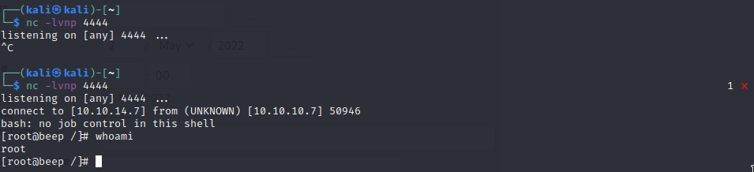 

### Flags
User:
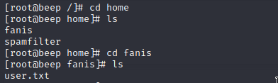 

Root: 
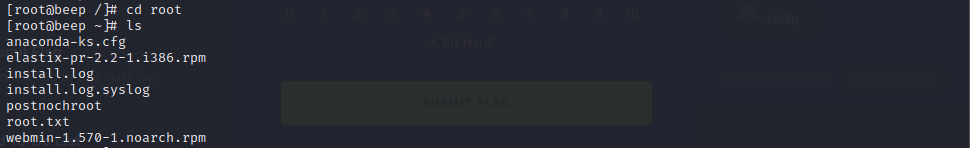 