# Blocky

Machine: [Blocky](https://app.hackthebox.com/machines/48)\
Difficulty: Easy\

## Enumeration
What ports are open?
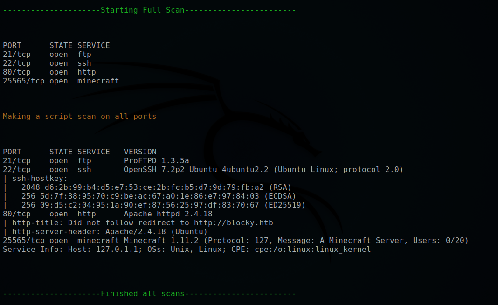

What are the versions of the services?
21/ftp - ProFTPD 1.3.5a
22/ssh - OpenSSH 7.2p2 Ubuntu 4ubuntu2.2 (Ubuntu Linux; protocol 2.0)
80/http - Apache httpd 2.4.18
25565/minecraft - minecraft Minecraft 1.11.2 (Protocol: 127, Message: A Minecraft Server, Users: 0/20)

### Ftp
For this FTP version, it looks like it might be vulnerable to this exploit: https://www.exploit-db.com/exploits/49908.

### Ssh
At first glance, this version does not appear to be vulnerable to anything. However, if I find any credentials then I might be able to use them via ssh to login.

### Http
For the version of apache, it looks like it might be vulnerable to a local escalation privilege vulnerability. https://www.exploit-db.com/exploits/46676.

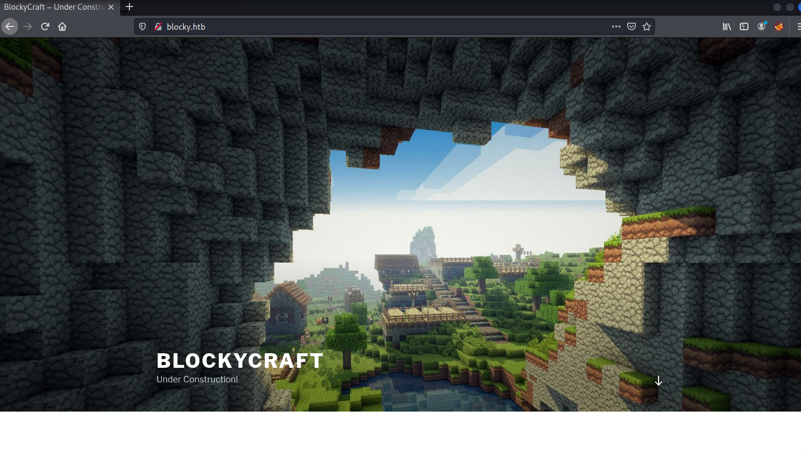

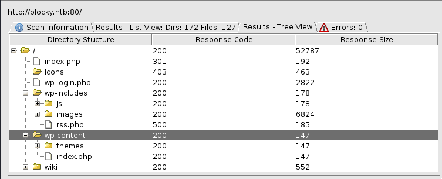

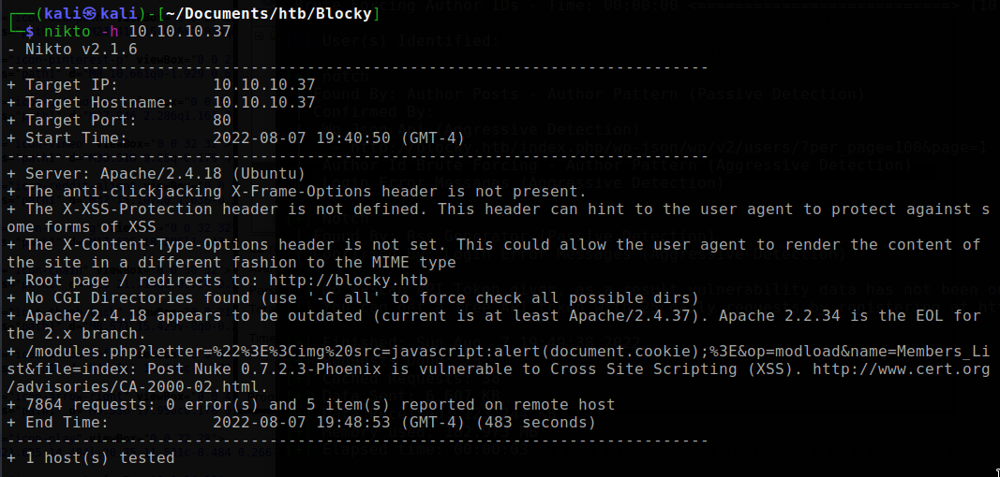

Below are the gobuster results:
<pre>gobuster dir -u blocky.htb -w /usr/share/wordlists/dirbuster/directory-list-2.3-medium.txt -x php -t 40</pre>
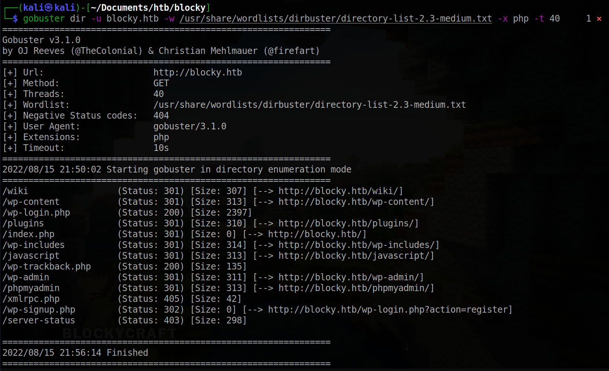

I do see that this is a wordpress site so I go ahead and enumerate more by using wpscan. I find that there is a user named 'Notch' or 'notch'.
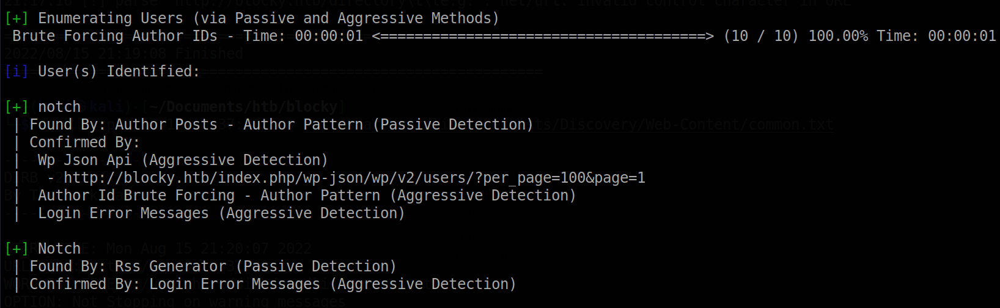

In the /plugins that we discovered by using gobuster, I found two jar files that I was able to download. I could not make out everything in the jar file, 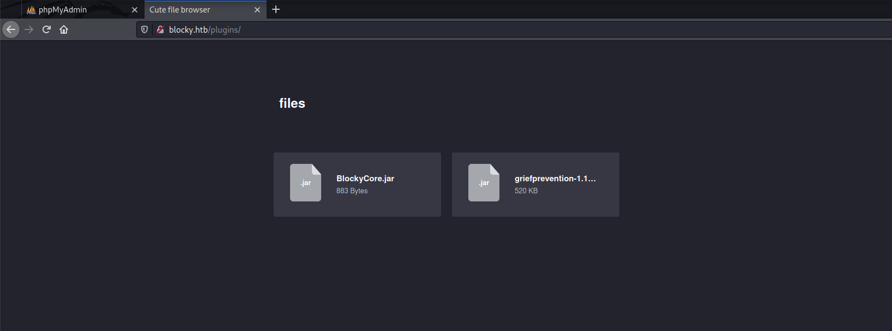

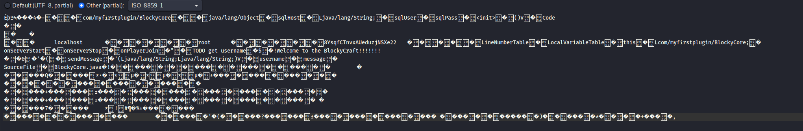

### Minecraft 
I did not find anything online that revealed any vulnerabilites for the version that is running on this machine.

## Exploitation
Turns out that the password that I found is a valid password for the user notch. We are able to ssh into the machine for the user notch.
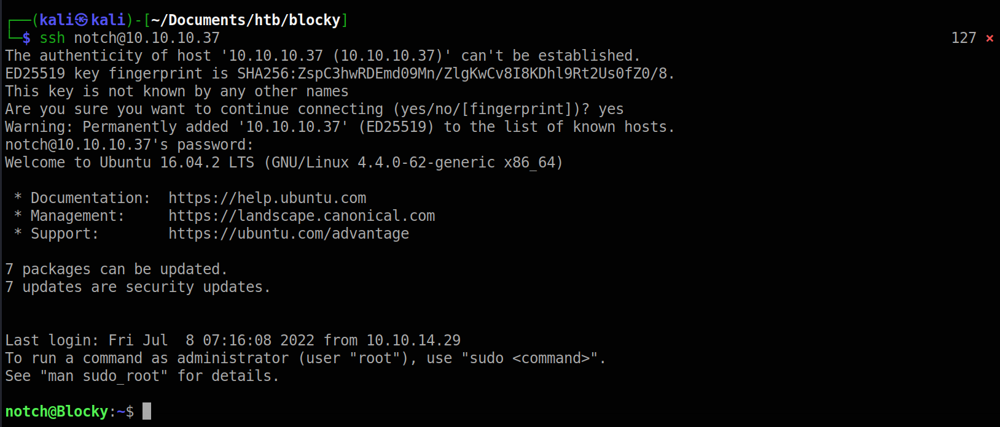

### Flags

#### User/Local flag
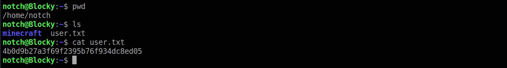

#### Root flag
To get root, I ran the command <pre>sudo -l</pre> to see what I can run as sudo with no password. To my suprise I can run any sudo command. Running sudo effectively makes me become root.
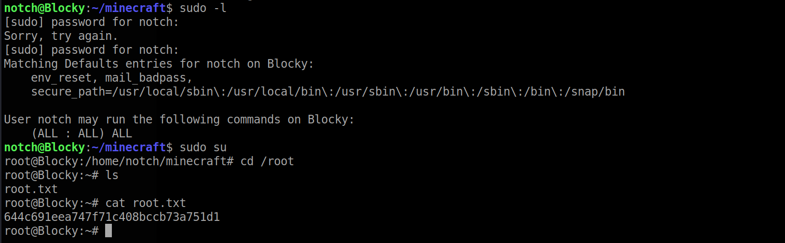

