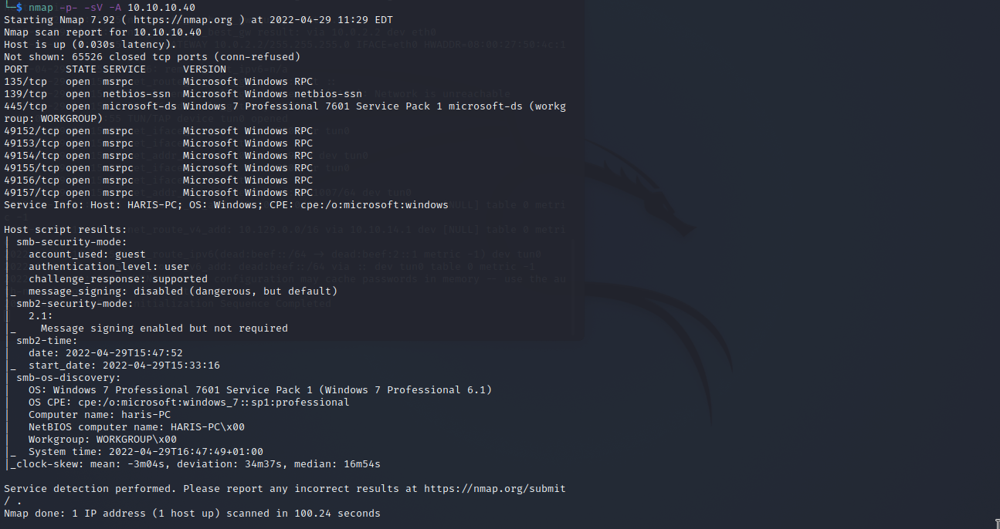
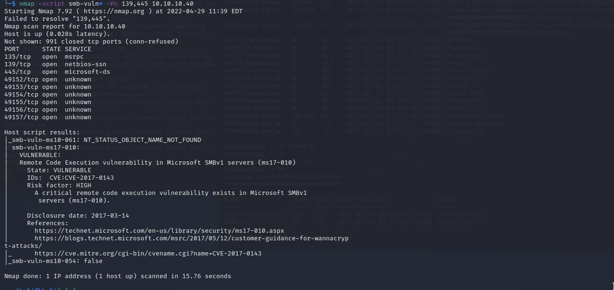
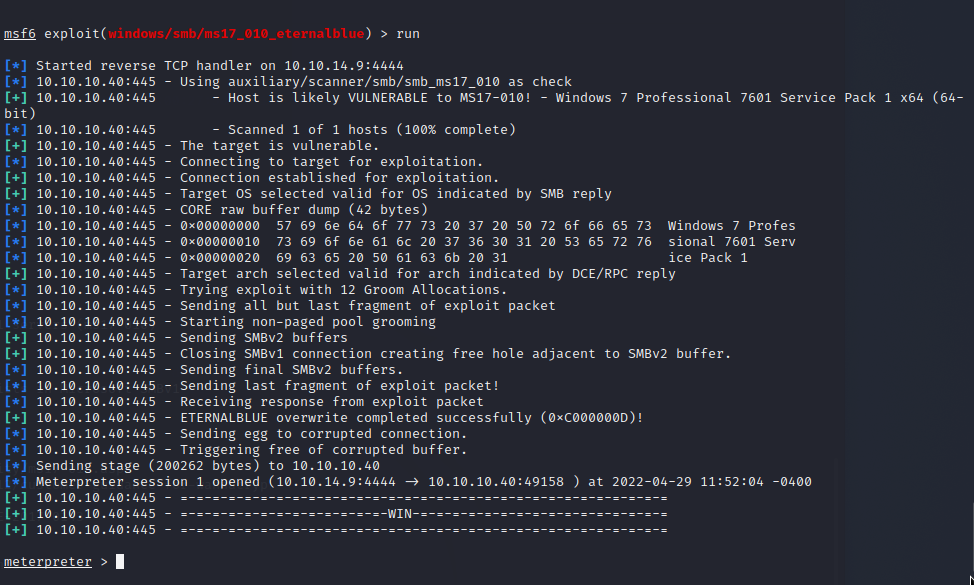
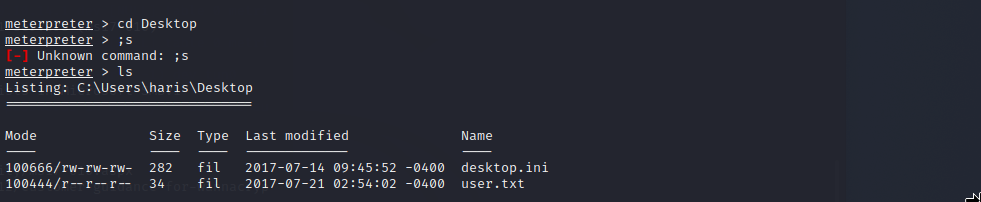
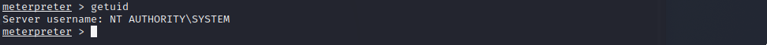
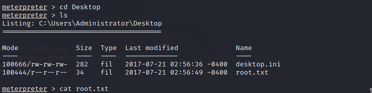

# Blue

Machine: [Blue](https://app.hackthebox.com/machines/51)\
Difficulty: Easy\
Status: Retired

## Enumeration

What operating system is on this machine? Windows 7
What ports/services are on running on this machine? 

- 

Since smb is running on this machine, I went ahead and ran a nmap script to check for smb vulnerabilites.

- 

Now that we know that the machine is vulnerable, lets exploit it.

## Exploitation

The first thing I tried was to search the vulnerability in metasploit.
With Metasploit:
- 

### Flags
User:
- 

Root: 
- 

- 