# FriendZone

Machine: [FriendZone](https://app.hackthebox.com/machines/173)\
Difficulty: Medium\

## Enumeration
What ports are open?
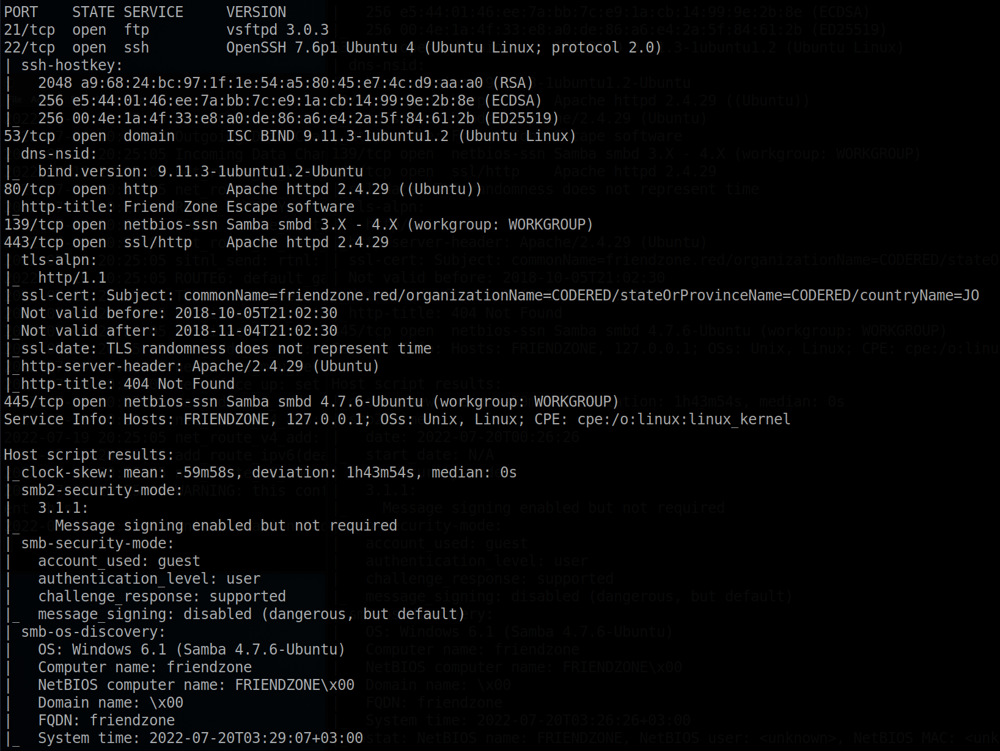

What are the versions of the services?
ftp - vsftpd 3.0.3
ssh - OpenSSH 7.6p1
dns - ISC BIND 9.11.3-1ubuntu1.2
http - Apache httpd 2.4.29
smb - Samba smbd 3.X - 4.X
https - httpd 2.4.29

### FTP
I found that the version of ftp runnnig on this machine is vulnerable, but I don't think the DOS vulnerability is what I should be looking for.

### DNS 
Ran this command: <pre>dig axfr friendzone @10.10.10.123</pre>
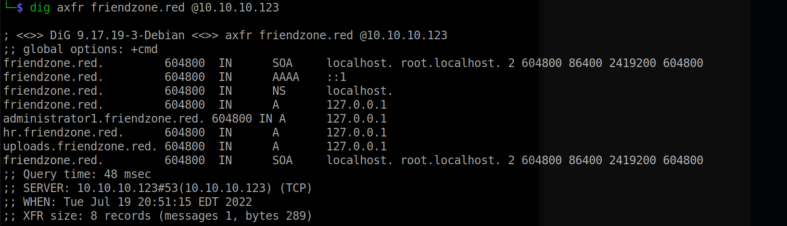

I tried to enumerate other subdomains, but I was getting so many success hits that it did not seem right. Anyways I added the domains returned from the dig command to the /etc/hosts file.

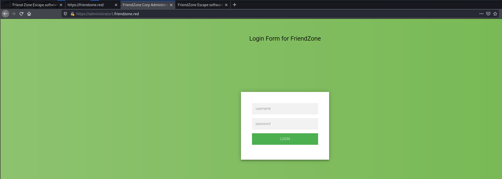

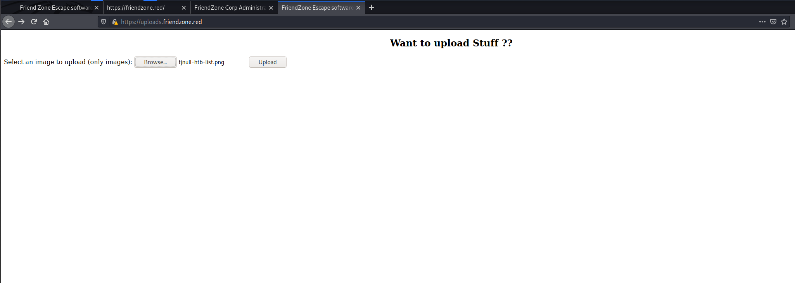

<< Maybe I can try to use burpsutie repeater and sqli the login parameters...similar to how it is done in the Trick htb machine >>>

### Http

Dirbuster results:
I ran a dirbuster scan but nothing of significance was discovered.
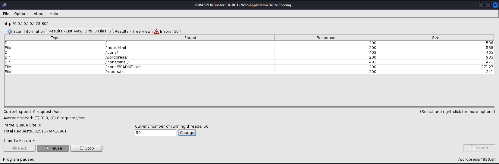

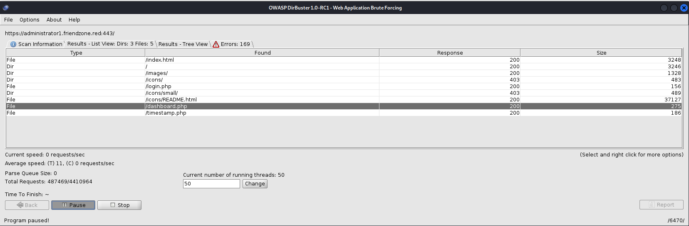

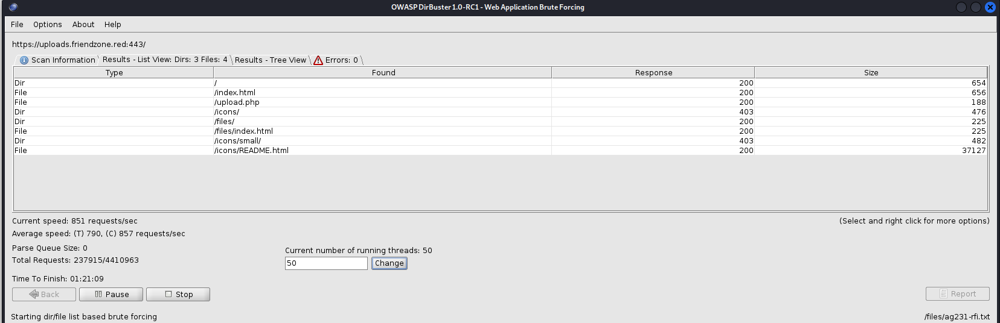

### SMB enumeration
To enumerate SMB, I used SMBMap and smbclient. I was able to find a couple of shares that I had permissions to read, and surely enough one of the shares had a creds.txt file.

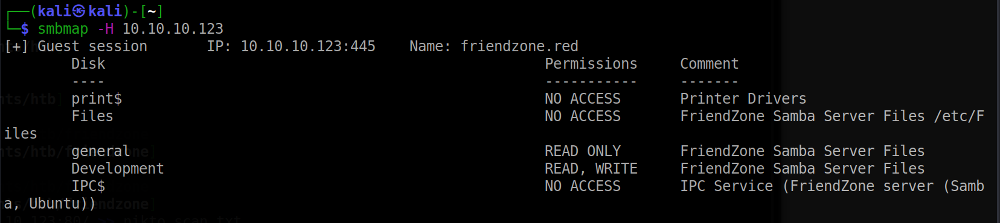

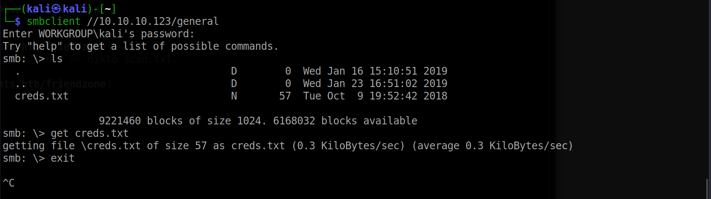

In the creds.txt file that I found, it says to use them for the "admin thing". Previously I found an administrator domain that had a login page, but I did not have the credentials at the time.

_______

Next I used the credentials I found to login. The credentials worked, and a page was displayed that asked me to visit dashboard.php.

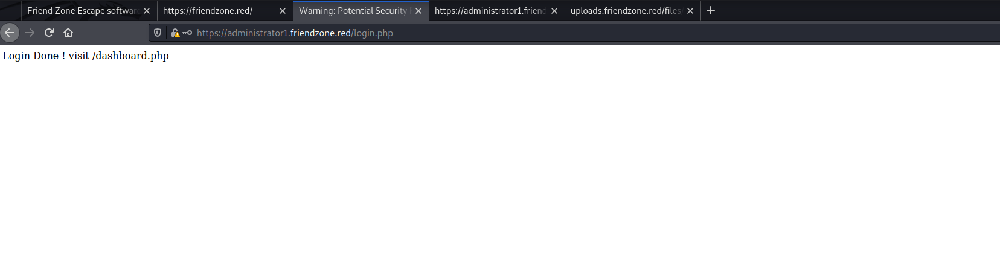

Now that I can access the webpages, I tried to upload an image and retrieve the image by modifying the parameters in the url but I did not have any success. I could upload the image file but I could not figure out how to return it...my thinking is that I could upload a reverse shell and change the file extension to see if I can find a way to spawn a reverse shell.  I was stuck on this for a while so I turned online to get some guidance for this machine. 

php://filter/convert-base64-encode/resource=(THE FILE YOU WANT TO INCLUDE)

After some guidance, I found that there is a LFI vulnerability. I did not know I could do this with php, but I can enter this as the value for a parameter and get files. Initially I tried to grab some common files on linux such as /etc/passwd, but it was appending .php to every file I put in the parameter. I went back and looked over the smbmap out and examined it carefully. Even though I was able to get the creds file in one of the shares, I did not notice that beside one of the shares it said that it was located in "/etc/Files". Based on this I can assume that the other shares listed are also under /etc. I did not have access to the Files share, but I did have read/write access to the Development share. I upload a php reverse shell to the Development share and navigate to that file in the url, and I was able to get a reverse shell!

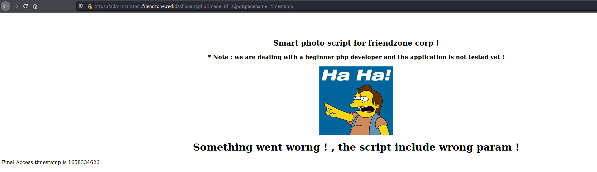

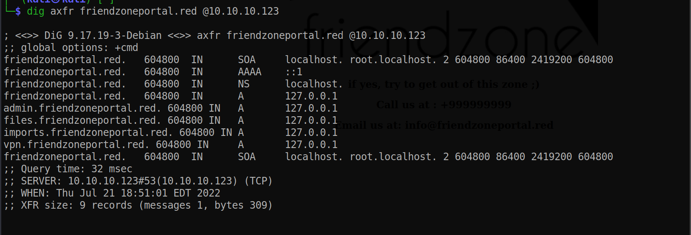

## Flags

### User/Local flag
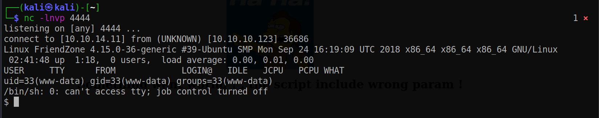
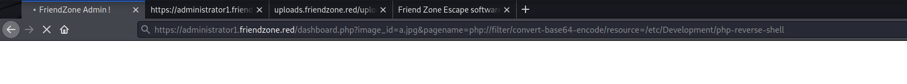
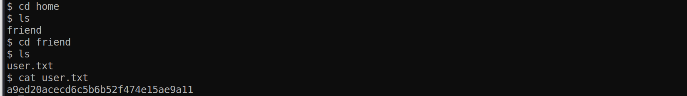

### Root flag

