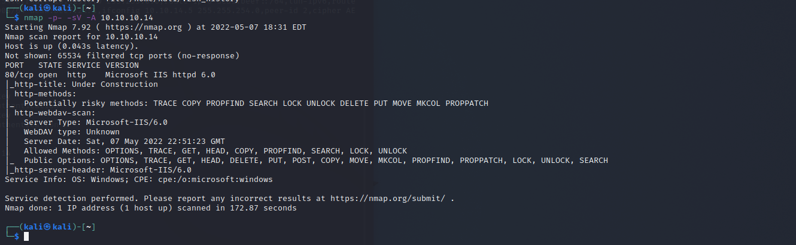

# Grandma

Machine: [Grandma](https://app.hackthebox.com/machines/14)\
Difficulty: Easy\
Status: Retired

## Enumeration

What operating system is on this machine? Windows
What ports/services are on running on this machine? 
 

Based on this information, I was able to search up the version info online and found that there is a CVE for the version running on this machine. Next, I use searchsploit to search the cve number to see if there is an exploit in metasploit. There is an exploit available for the CVE number so I set the options needed and run the exploit.
-[Results!](screenshots/2.png) 

## Exploitation
After getting a meterpreter shell, I tried to run a couple of windows commands to get some information. I ran 'getuid' to see who I am. Turns out I am not able to run that command, so I don't know who I am. I hoping to see something with 'System' in it, but I did not expect to get nothing. Since I don't know who I am on the machine, lets view the list of processes running and who the processes are running as. In the image below we see that there are a few processes running as 'NETWORK SERVICE'. If I migrate to the processing being run by 'NETWORK SERVICE', I am effectively that user now.
-[Results!](screenshots/3.png) 

At this point I was stuck, and I could not figure out what to do. I turned to a walkthtough and discovered that I can use a metasploit module named 'suggester' that will scan the windows machine for vulnerabilites. I did have an issue with this because the module required to to have the meterpreter session in the background, which I had, but the session would end everytime I ran the 'suggester' module to find vulnerabilites. Anyways, when the 'suggester' module works correctly, it will give a list of vulnerabilites that you can exploit on the target machine. I don't think it ranks them from best to worst, but you can just go one-by-one to see if they give a reverse shell on the target machine as System. \
-[Results!](screenshots/4.png) 

Since my suggester module didn't work properly, I just looked up the module that will do this exploit and entered it manually in metasploit.

-[Results!](screenshots/5.png) 

### Flags
User: 
-[Results!](screenshots/6.png) 
Root: 
-[Results!](screenshots/7.png) 

