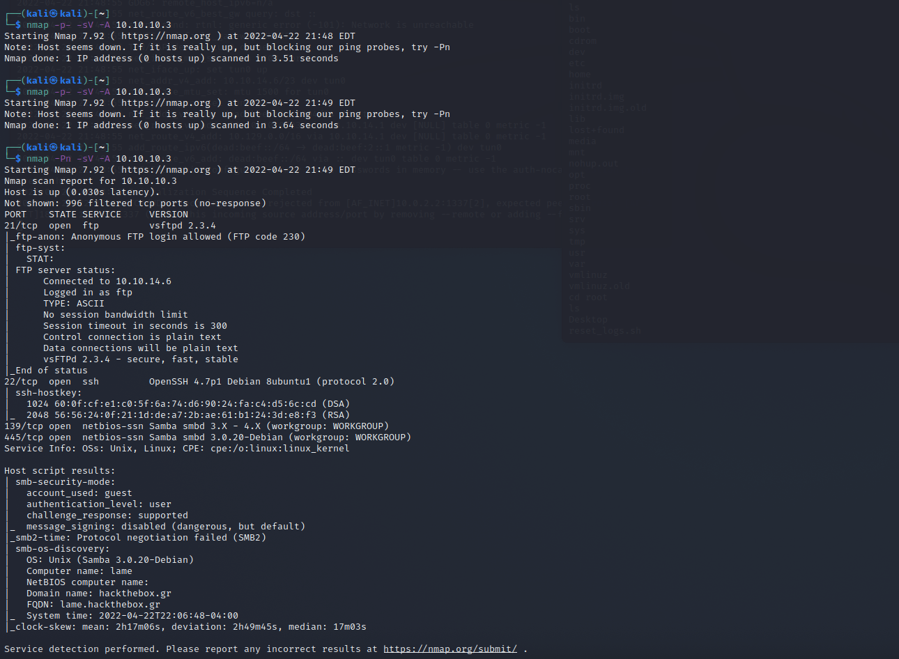
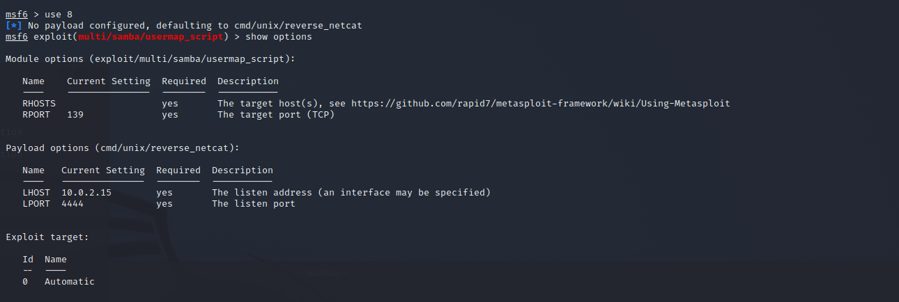
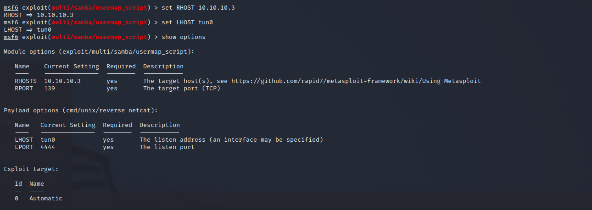
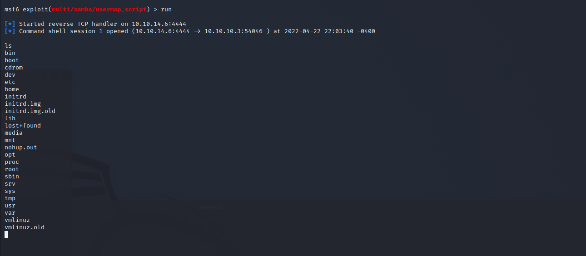
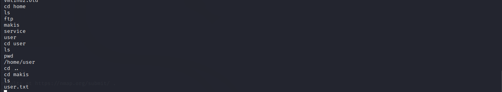
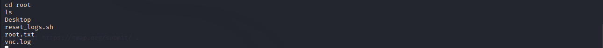

# Lame

Machine: [Lame](https://app.hackthebox.com/machines/Lame)\
Difficulty: Easy\
Status: Retired

## Enumeration

What operating system is on this machine? Linux
What ports/services are on running on this machine?
- 

Can you access any of the ports on this computer? (Example: 10.10.10.3:80). No

Are any of the running services vulnerable?
Port 21 - https://nvd.nist.gov/vuln/detail/CVE-2011-2523
Port 22 - https://amolblog.com/port-22-tcp-open-ssh-openssh-4-7p1-debian-8ubuntu1-protocol-2-0-exploit/
Port 139/145 - https://amolblog.com/139-tcp-open-netbios-ssn-samba-smbd-3-x-4-x/

## Exploitation

After trying a few things and doing a little research online, I found a metasploit module that will allow us to get a reverse shell due to a smb vulnerability.

Options:
- 

- 

Run exploit:
- 

### Flags
User:
- 

Root: 
- 
