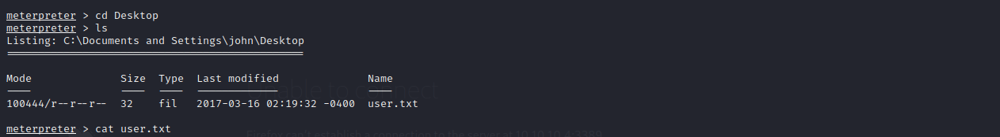

# Legacy

Machine: [Legacy](https://app.hackthebox.com/machines/2)\
Difficulty: Easy\
Status: Retired

## Enumeration

What operating system is on this machine? Windows XP
What ports/services are on running on this machine?
- 

Can you access any of the ports on this computer? No

Since smb is running on this machine, lets use nmap to see if it is has any known vulnerabilites.

- 

## Exploitation
First I will do this exploit without using metasploit .

With Metasploit:

- 

### Flags
User:

- 

Root: 

- 

