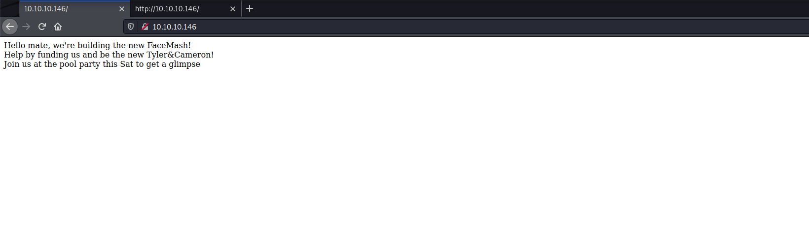

# Networked

Machine: [Networked](https://app.hackthebox.com/machines/203)\
Difficulty: Medium\

## Enumeration
What ports are open?

What are the versions of the services?
22 - OpenSSH 7.4
80 - Apache httpd 2.4.6 ((CentOS) PHP/5.4.16)

## Http
Navigating to the html page, this is what we see. This webpage does not seem to be of any significance, but the page source has some information listed in the comments that might be usedful.

It says that the upload and gallary are not yet linked. Given the name of the machine is called 'Networked', I am thinking that I have to connect the webpage to upload and gallary...whatever these are.

Below are the dirbuster results.

Below are the dirb results.

Next, I went ahead and ran Nikto to see what it will find.

Going to the backup directory, we see that there is a .tar file available to download. Let's download it, extract, and see what information we can find.
The backup.tar file contained the source code for the files listed below. I cna view the source code for these files, but I cannot view the source code for the same files when checking the 'view page source' in the browser. 

After examing the files, I see in the upload.php that there are a couple of conditions that need to be met before an image will be uploaded successfully. It needs to be on a certain file type and under a certain size. So, I used my normal php reverse shell, I setup a netcat listener, uploaded my reverse shell with .jpg extension and received an error. Examining the php code again, I see that the magic bytes need to be added to the file so that it will think that the file we upload is an actual image and not something else. I run the below command to add the magic bytes to the .php.jpg file I am uploading.\
Command: echo '89 50 4E 47 0D 0A 1A 0A' | xxd -p -r > php-reverse-shell.php.jpg\

This file was successfully uploaded but I did not get a shell. I created a new php script to upload to see if it would work.

TO BE CONTINUED..........

## Flags

### User/Local flag

### Root flag

