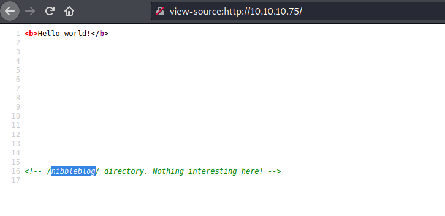

# Nibbles

Machine: [Nibbles](https://app.hackthebox.com/machines/Nibbles)\
Difficulty: Easy\
Status: Retired

## Enumeration

What operating system is on this machine? Linux\
What ports/services are on running on this machine? 
- 

Can you access any of the ports open on this machine? Yes, port 80.
- 

Since I can access the webpage, I will take a look at the page source to see if there is any valuable information that may help us.

The page source did provide us a directory that we can navigate to. In the meantime, I am going to run dirb to see if there are any other directories present. 

- 

After running dirb, I was not able to find much other than one directory. In the directory that I found, I tried to see if it contained any scripts files by using the dirb tool because I did not have access to the folder.

- 

- 

Since I did not find much, I decided to mess around a bit on the /nibbleblog directory that was listed as a comment in the page source.

- 

After clicking on some links to see what would happen, one brought me to this page.

- 

In the image above, it lists a different IP address than the one we are using for the machine, so I thought I would try to navigate to the page that it is showing in the image above...turns out I could not access it.

I figured I would check to see if that host was even on the same network as me, so I ran another nmap scan to see what hosts were up. I even tried to ping the machine and I couldn't reach it so I figured this ip address was not of that much importance. 

- 

After this I was kinda stuck, so I went online to find someone else's walkthrough/steps for this machine. I found out that the dirb tool I was using was not as good as some of the others such as dirbuster...at least dirb wasn't good the way I was using it. Anyways, using dirbsuter showed that there is an admin login page. The username/password is admin/nibbles. I don't know if there is a way to find out the password, but most people from what I saw just knew the password was nibbles....Obviously it's the name of the box, but I wouldn't think the name of the box would be the password to an admin account.

- 

- 

## Exploitation

### Flags
User:

- 

Root: 

- 

How can I escelate my priv?  First I can create a shell and see what files I can run as sudo.

The reason I want to look for if there are files that I can run as sudo because I will more than likely have the permissions to read, write, and execute....meaning I can change/edit a file to create a reverse shell with sudo priv.  I started netcat to listen on a port, and then on the victim machine I changed the file that allowed me to execute as sudo so I can get a reverse shell.

- 

## Overview
Overall, I think this was a good machine. The only thing I was did not like is that the other tutorials that I read all seemed to know the admin credentials and without the credentials then the metasploit module could not be executed. Maybe there is a way to brute force this and get the information that way.  

Having to modify a file on the remote machine to create a reverse shell was interesting and something I will note down for the future. I definetly need to practice privilege escalation though.

