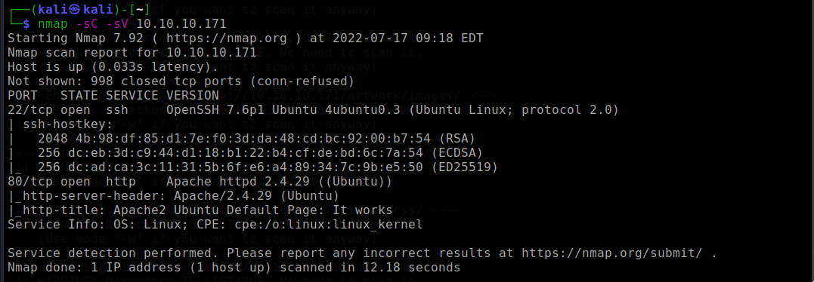
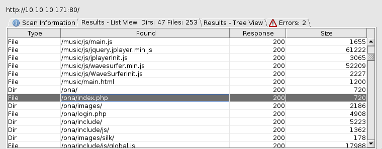
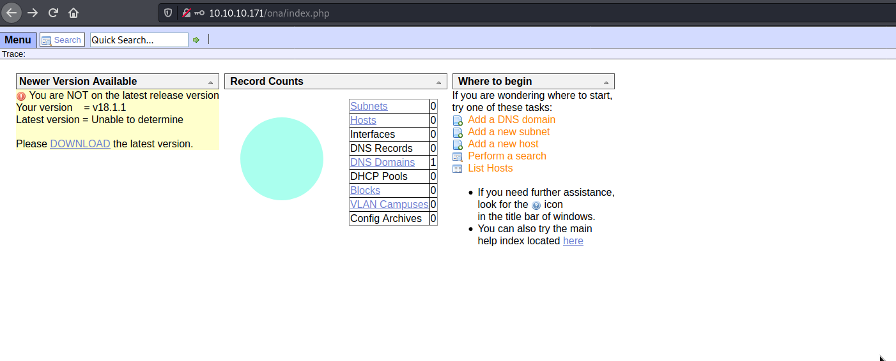
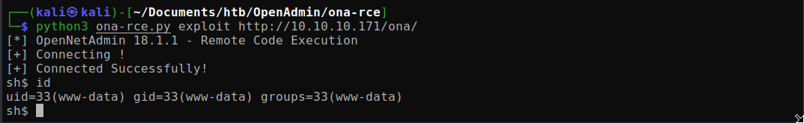
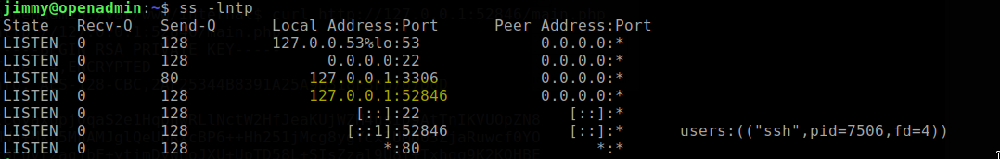
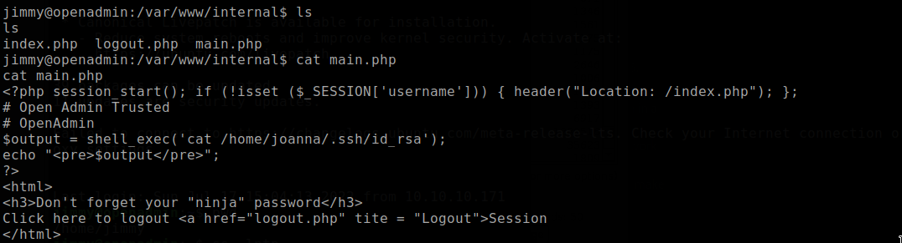
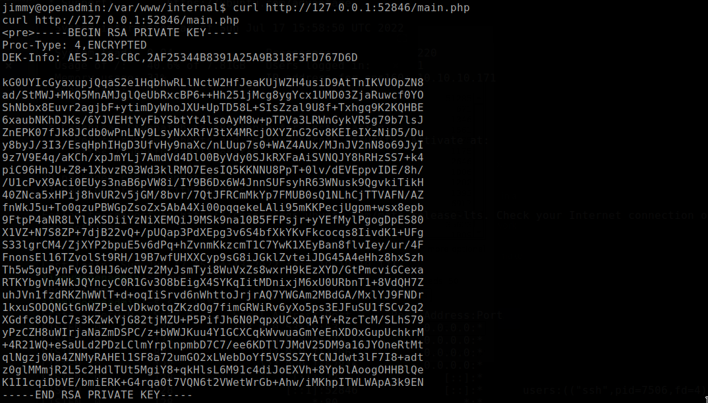
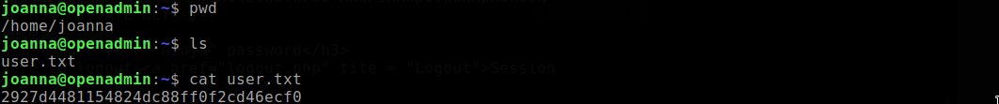
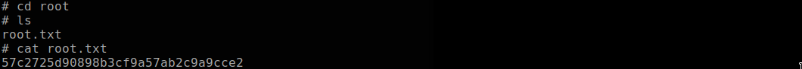

# OpenAdmin

Machine: [OpenAdmin](https://app.hackthebox.com/machines/222)\
Difficulty: Medium

## Enumeration

What ports are open on this machine?

Since http is running on this machine, I started a directory scan and I found the home page for open admin.

I spent some time walking the website to see what I could find, how it works, and did some research online to see what I can find out about Open Admin. On the home/index page, you can see in the top right corner that you are logged in as 'guest'. I go ahead and try to login as 'admin/admin' and surely enough I was able to login as admin. I did not know the credentials prior to logging in, I'm sure a quick google search would return the default creddentials and possible users already on Open Admin.

Also, in the image above we can see that this instance of Open Admin is using version 18.1.1. A quick search online returns that this version is vulnerable to RCE! I tried a couple of implementations that I found online but they either did not work or I was able to get a shell but could not move out of the directory. I ended up this implementation of the exploit [here](https://github.com/d4t4s3c/OpenNetAdmin18.1.1RCE).

## Flags

### User/Local
I find out that I am unable to access neither of the user directories so I will need to some privsec. After a while, I had to turn to online to get help and found that there is something that I missed...there is another port open that is running on this machine.

Now that I have the RSA key of the user Joanna, I cna try to login as Joanna. It turns out that I also need to enter the passphrase in addition to providing the RSA key. To get the passphrase we can extract the hash from the RSA key and then use John The Ripper to crack the hash. To get the hash, I used the tool ssh2john.py.
<pre>/usr/share/john/ssh2john.py joanna_rsa > joanna_rsa.hash</pre>

<pre>john --wordlist=/usr/share/wordlists/rockyou.txt joanna_rsa.hash</pre>

John cracked the hash and I was able to login as Joanna and get the user flag!

### Root
For the root flag, I found that I can run the following command as sudo. I used linpeas to get this information and then I used gtfo and followed the steps to spawn a shell for nano. Once I spawned a shell I was able to get the root flag!
<pre>/bin/nano /opt/priv</pre>

