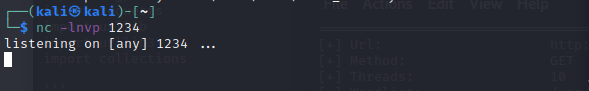

# Sense

Machine: [Sense](https://app.hackthebox.com/machines/111)\
Difficulty: Easy\
Status: Retired

## Enumeration

What operating system is on this machine? Linux
What ports/services are on running on this machine? 

Since we know there is a webserver running, lets use dirbuster to scan for directories and other files.

From the directory and file scan, we do see a log.txt file that might have some useful information in it and we notice that it is accessible due to the 200 status code showing in the scan.

Based on this, there is something vulnerable on this webserver. Side note, I do see a reboot.php file, so that might be useful to use but I don't know yet. Also, the vulnerability might be due to a firewall misconfiguration or something based on the changelog.txt file. 

The system-users.txt file found seemed to just contain instructions for a support ticket that needed to be created. I tried to login with the username and credentials that it provided in the file (Rhoit,pfsense) and that did not work.

At this point I was somewhat stuck. I could not login and I could not find any vulnerabilites that I could exploit for lighttpd 1.4.35.  I then find out the Rhoit username that I tried to use needs to be a lowercase 'r' which that will result in me being able to log in. 

## Exploitation

I messed around and found where you could upload an image. I tried to setup a netcat listener and upload a php reverse shell file to see if I can get a reverse shell that way but it did not work.  Next, I used searchsploit and metasploit to find vulnerabilites and exploits with pfsense.

Copy the exploit to my current working directory. 

By examining the python script, we can see the parameters needed to pass to the script for the exploit to work.

Now we run this command:

Now we have the reverse shell, and we are the root user which is great!!

### Flags
User:

Root: 

