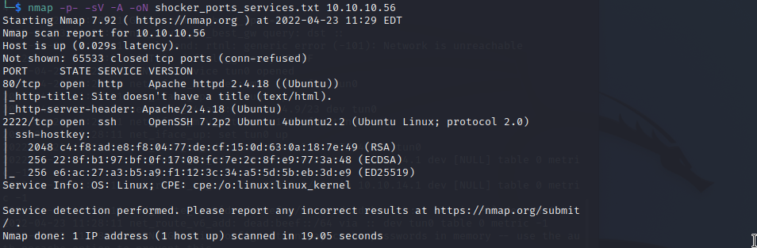
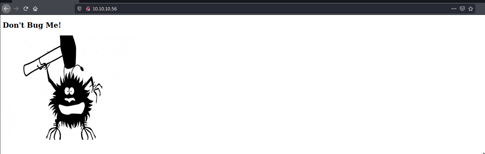
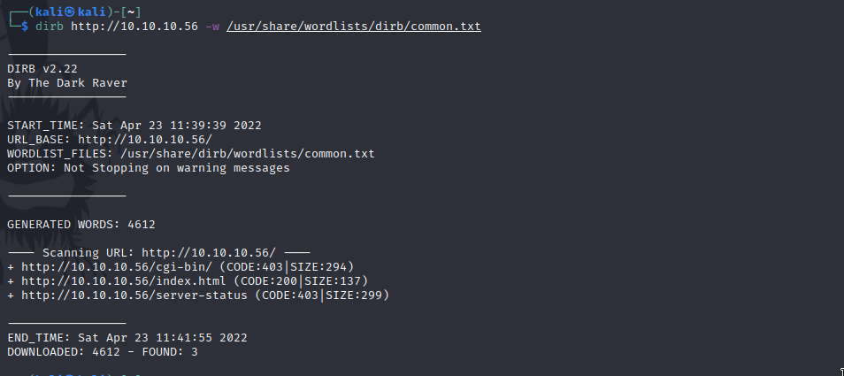
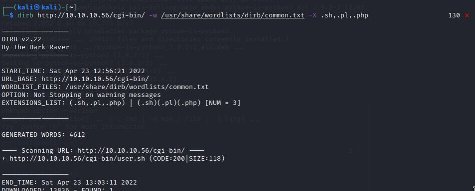
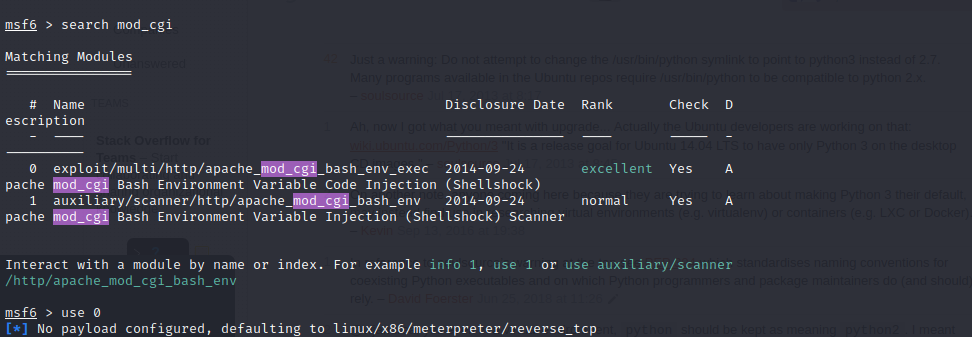
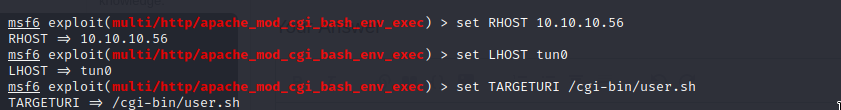
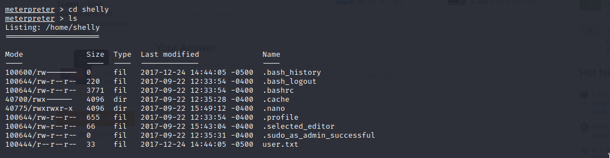
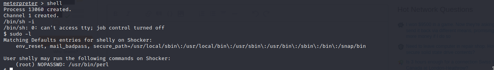
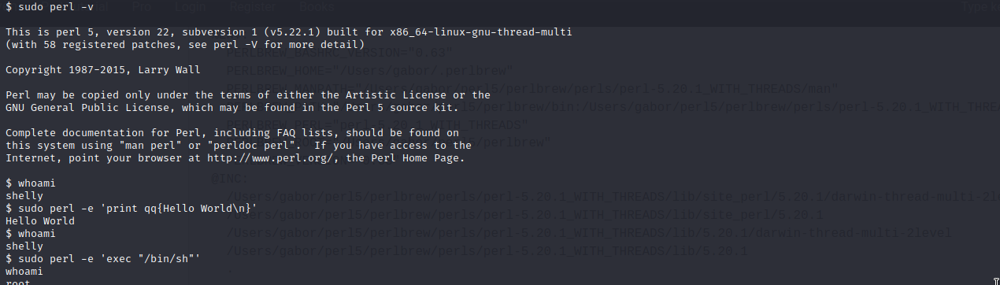
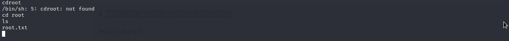

# Shocker

Machine: [Shocker](https://app.hackthebox.com/machines/Shocker)\
Difficulty: Easy\
Status: Retired

## Enumeration

What operating system is on this machine? Linux
What ports/services are on running on this machine?

- 

Can you access any of the ports on this computer? Yes, I can access the http port 80 (10.10.10.56:80).

- 

After accessing the page, I view the page source to see if there is any valuable information. The page source did not provide anything valuable to me so I moved on.

Since I know that http is open on this machine, I am going to go ahead and use a tool called dirb to enumerate potential directories. 

dirb http://10.10.10.56 -w usr/share/wordlists/dirb/common.txt

- 

I can see that we found 3 directories but there are a couple of directories that we are not authorized to access. Just because we are not authorized to go to a directory does not mean we can not figure out what is inside that directory. 

- 

Are any of the running services vulnerable?
Port 80 - I found this CVE which looks like this will be important: https://www.exploit-db.com/exploits/34900

## Exploitation
First I will do this exploit without using metasploit 

With Metasploit:

- 

- 

Options:

Run exploit:

### Flags
User:

- 

Root: 

Lets checki f there are any sudo users on this machine

- 

We can see that we can run perl commands as sudo (root), so lets try to run some.

- 

I was still shelly after running a couple of sudo perl commands. Researched a little online and apparently you need to create another shell using a perl command as sudo inorder to be root.

- 