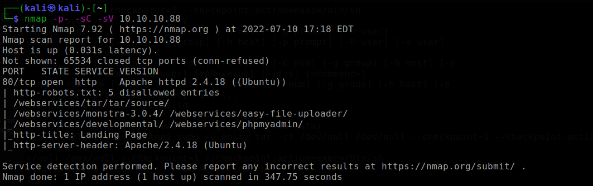
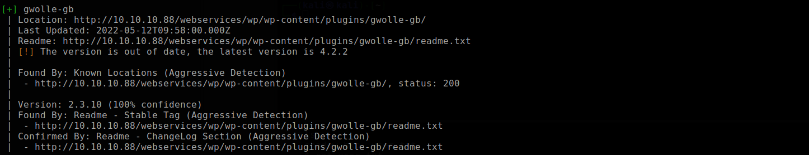
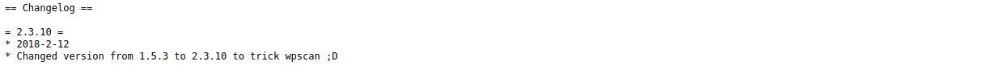
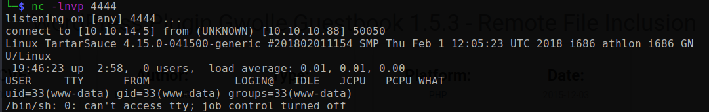
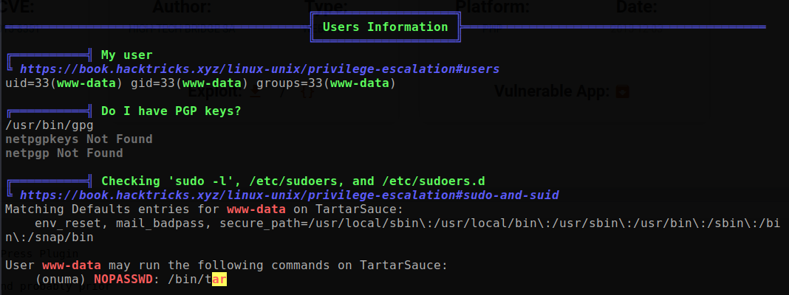
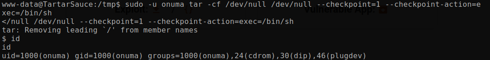
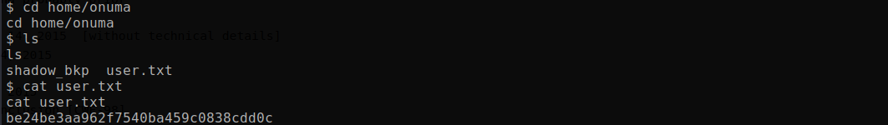
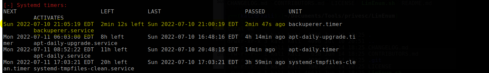

# TartarSauce

Machine: [TartarSauce](https://app.hackthebox.com/machines/138)\
Difficulty: Medium

## Enumeration

What operating system is on this machine? Linux
What ports/services are on running on this machine?

I went ahead and started my directory scan and shortly after I find the robots.txt file that include and entry for monstra. I navigate to this directory and walk through the site. Eventually I find the login page and just try to login as admin/admin and surely enough that was the correct username/password. I tried to find a tool to enumerate monstra users, but I did not find anything. I am also not sure if there is a hint on the machine reguarding the credentials either.

I did find an exploit for the version of mantra that is installed, but I could not get the file to be uploaded. After trying numerous things to get upload a file to get RCE, I looked back at the directory scan results to see what else is discovered. I find that wordpress is installed on this machine, so I started a wpnscan. I used the below command to find a vulnerable plugin being used:\
<pre>wpscan --url http://10.10.10.88/webservices/wp/ -e ap --plugins-detection aggressive</pre>

Going to the plugin readme, it tells us some information about the plugin. It also has a note in it that gives away that the version of the plugin was changed to trick the attacker.

Once I knew the correct version of the plugin, a quick online search shows that this version of the plugin has a RFI (remote file inclusion) vulnerability. The exploit is [here](https://www.exploit-db.com/exploits/38861).  Basically we can point the url to a server, in this case it will be my server, and have it retreive the 'wp-load.php' file. I created a file called wp-load.php and put php code that will spawn a reverse shell. following the instructions for the exploit, I was able to get a reverse shell!

## Flags
### Local/User
At first, I was unable to get the local/user flag as the www-data because I did not have permissions to that directory. I then uploaded linpeas to the /tmp directory and found that I scan run the below command as the onuma user with no password.\

I used gtfo bins to get a command that I can use on the tar binary.\ 

Now we have the user flag!\

### Root
I used linpeas.sh to enumerate the machine as the onuma user to see if I could find anymore information, and the only thing I could find is that the machine is likely vulnerable to what is called dirty_sock. I try this exploit but I could not get it to work so I got stuck so I turned to online for some help.\

Next I uploaded LinEnum to the machine, and found an interesting timer that is being run frequently. From what I learned, the Systemd timer is basically a cron job being run from a service. 

*** INCOMPLETE ***

