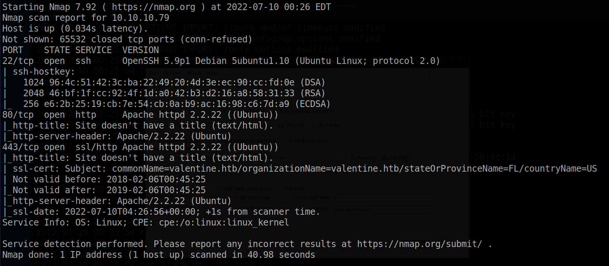
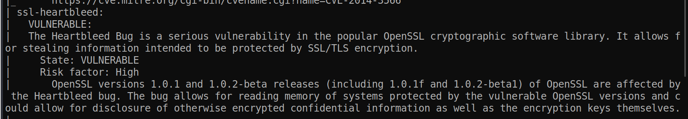
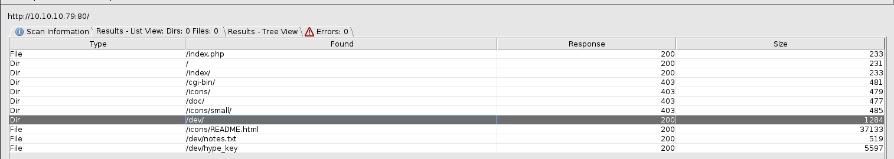
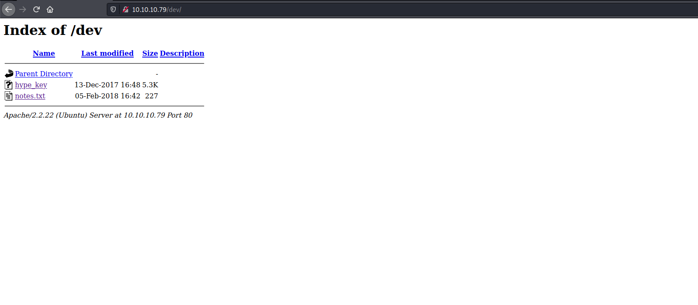
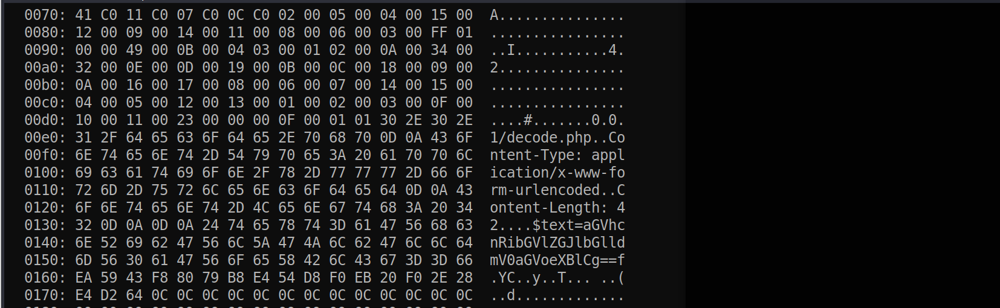
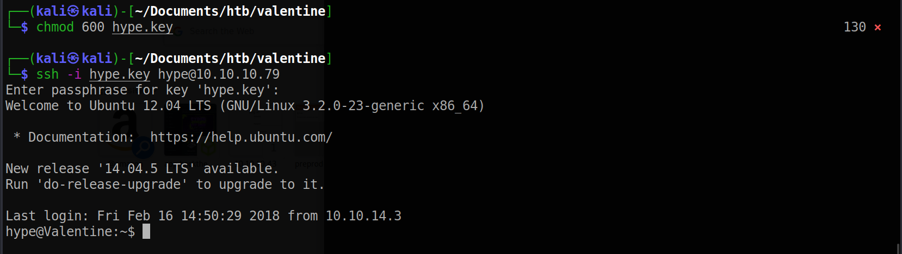
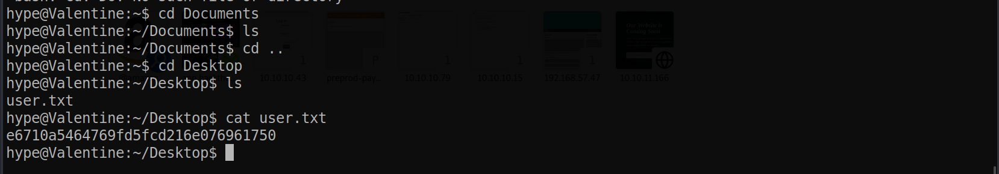
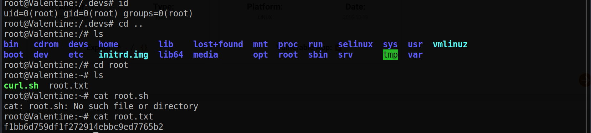

# Valentine

Machine: [Valentine](https://app.hackthebox.com/machines/Valentine)\
Difficulty: Easy\
Status: Retired

## Enumeration

What operating system is on this machine? Linux
What ports/services are on running on this machine?\ 

I went ahead an run a vulnerability scan with nmap, and I can now see that the machine is vulnerable to an attack called heartbeed.
<pre>nmap --script vuln 10.10.10.79</pre>

Since we have an http server running on this machine, we will enumerate the directories to see what we can find. Once the scan the was complete, I discovered a directory called 'dev' that had two important files. One of the files contained hex values that needed to be decoded. Once the values are decoded I can see that the hex file is actually an RSA private key!

I found a couple of heartblood exploits online and with searchsploit, but since I am using python3 I could not get them to work. Instead, I ended up using this python3 version of heartbleed [git repo](https://gist.github.com/akshatmittal/10279360). Running this exploit, we can see that the script is dumping information from memory and we are able to receive some base64 encoded text. The decoded text is equal to heartbleedbelievethehype.

I don't know what this text is for, but since we have the private RSA key, ssh is open on the machine, and I found some text from the exploit, the text might be the password for the user of the RSA key. It is common practive that if you have an rsa key, then it typically has the name of the user in the first part of the key name. Reffering back to the /dev directory, I see that the RSA key is name hype_key. 
In this case the user would be hype, so now we can try to login as the hype user.\

## Exploitation

### User/Local flag

### Root flag
To escalate priveleges, we actually find some intersting information in the bash history file which can be viewed with the following command: 
<pre>cat ~/.bash_history</pre>

I see that there is a command being run called tmux. I did not know what this is so I had to do some research. 

